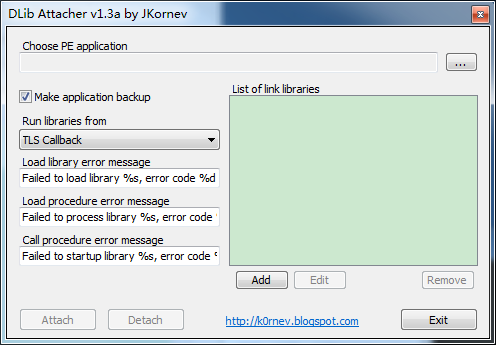

DLib-Attacher  by JKornev
=============

Simple program for static hooking dynamic libraries in executable application

给PE添加dll,只支持32位程序。

Fork Form [GitHub](https://github.com/JKornev/DLib-Attacher)

